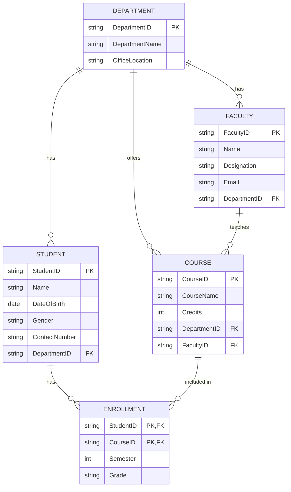

# College Database ER Diagram

Below is the Entity-Relationship (ER) Diagram for the College Database.

```mermaid
erDiagram
    DEPARTMENT ||--o{ STUDENT : "has"
    DEPARTMENT ||--o{ FACULTY : "has"
    DEPARTMENT ||--o{ COURSE : "offers"
    
    FACULTY ||--o{ COURSE : "teaches"
    
    STUDENT ||--o{ ENROLLMENT : "has"
    COURSE ||--o{ ENROLLMENT : "included in"

    DEPARTMENT {
        string DepartmentID PK
        string DepartmentName
        string OfficeLocation
    }

    COURSE {
        string CourseID PK
        string CourseName
        int Credits
        string DepartmentID FK
        string FacultyID FK
    }

    STUDENT {
        string StudentID PK
        string Name
        date DateOfBirth
        string Gender
        string ContactNumber
        string DepartmentID FK
    }

    FACULTY {
        string FacultyID PK
        string Name
        string Designation
        string Email
        string DepartmentID FK
    }

    ENROLLMENT {
        string StudentID PK, FK
        string CourseID PK, FK
        int Semester
        string Grade
    }
```
